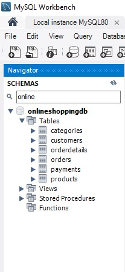
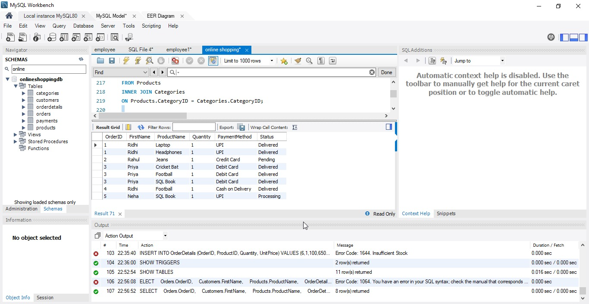
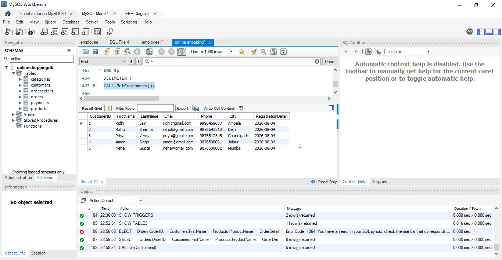
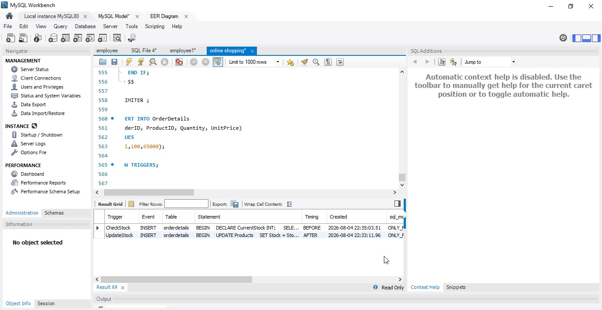

#  Online Shopping Database Management System

A relational database management system developed using **MySQL** to manage an online shopping platform. The project demonstrates database design, normalization, SQL queries, views, stored procedures, and triggers.

---

##  Features

- Customer Management
- Product Management
- Category Management
- Order Management
- Payment Management
- Inventory Management
- Sales Reports
- Customer Reports

---

##  Technologies Used

- MySQL
- MySQL Workbench

---

##  Database Tables

- Customers
- Categories
- Products
- Orders
- OrderDetails
- Payments

---

##  SQL Concepts Implemented

- Primary Keys
- Foreign Keys
- Constraints
- INSERT
- UPDATE
- DELETE
- SELECT
- WHERE
- ORDER BY
- INNER JOIN
- GROUP BY
- HAVING
- Aggregate Functions
- Subqueries
- Views
- Stored Procedures
- Triggers

---

##  Project Structure

```
OnlineShoppingDB
│
├── online shopping.sql
├── online_shoppingdb.sql
├── README.md
└── Screenshots
```

---

##  Project Screenshots

### Database



---

### ER Diagram


---

### JOIN Query



---

### Stored Procedure



---

### Trigger



---

##  Key Features

✔ Normalized Database Design

✔ Relational Database Schema

✔ Business Reports

✔ Inventory Management

✔ Sales Analysis

✔ Stored Procedures

✔ Automated Triggers

---

##  Future Scope

- Web Application Integration
- Power BI Dashboard
- User Authentication
- REST API Integration

---

## Author

**Ridhi Jain**

GitHub:
https://github.com/ridhiambala87

LinkedIn:
https://www.linkedin.com/in/ridhi-jain-13b3b5357/
